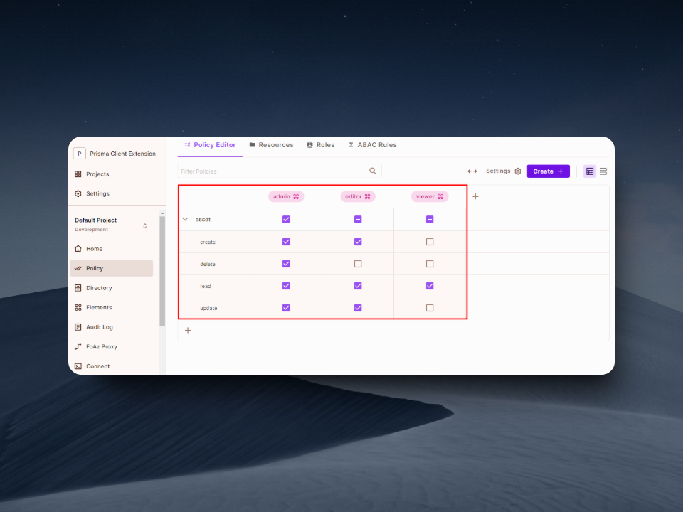

## Prisma Permit Authorization

Asset management system with role-based access control using Prisma and Permit.io.




### Features
- Role-based access control with Permit.io
- Asset category management
- User registration and authorization
- Prisma Client Extension for permission checks
- PostgreSQL with Neon serverless database integration

### Setup

1. Clone the repository and navigate into it:
```bash
git clone https://github.com/Tabintel/prisma-permit-auth.git
cd prisma-permit-auth
```

2. Install dependencies:
```bash
npm install
```

3. Create an `.env` file in the root directory, setup the database connection, and enter the details below. [Get your Permit.io SDK key](https://docs.permit.io/getting-started/quickstart)
```bash
DATABASE_URL="your-postgresql-url"
PERMIT_SDK_KEY="your-permit-key"
PORT=3000
```

4. Run migrations:
```bash
npx prisma migrate dev
```

5. Start the server:
```bash
npm run dev
```

### API Endpoints

Development server: `http://localhost:3000`

- `POST /api/users` - Register new user
- `POST /api/assets` - Create asset
- `GET /api/assets` - List assets
- `PUT /api/assets/:id` - Update asset
- `DELETE /api/assets/:id` - Delete asset

### Authorization

Configure roles and permissions in Permit.io dashboard:
- Manager: Full access
- Accountant: Financial reports access
- Developer: Software licenses access


